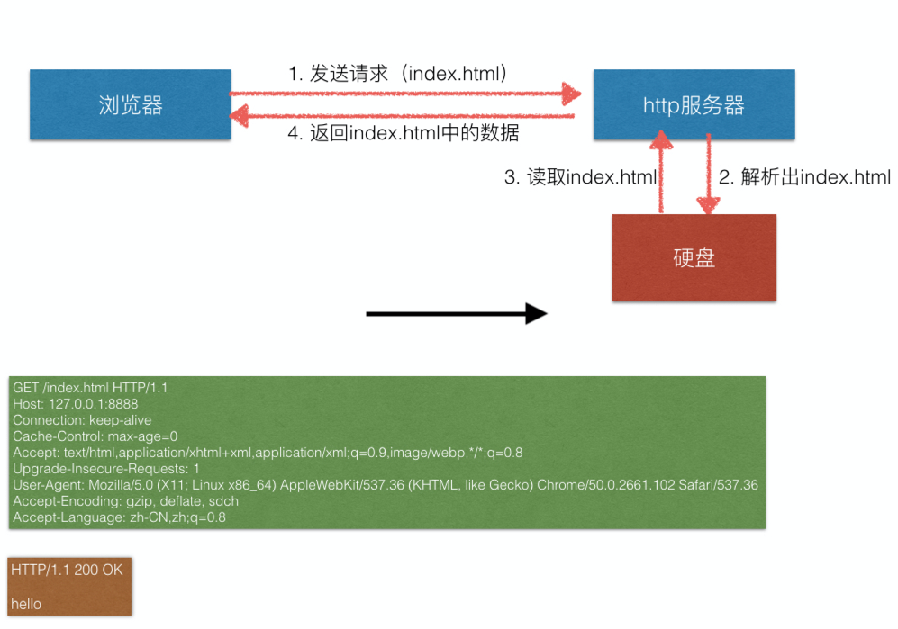
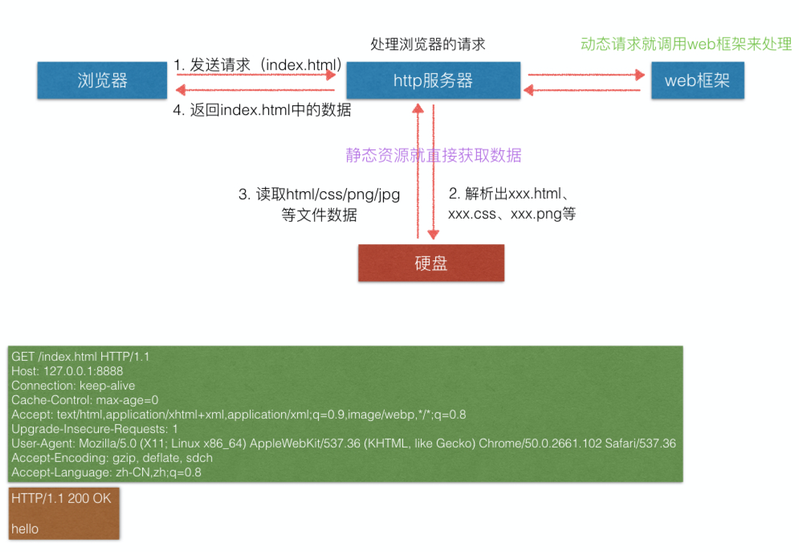

# 一步步实现web框架

一、对目录结构的介绍
----------------

1、http_server_1
---------------
用循序渐进饿的方式实现了浏览器与web服务器之间的通信

=======

2、http_server_v2
-----------------
是对http_server_1的升级，把框架单独提出来，封装成方法，用面向对象的方式实现http服务。
http服务器负责处理静态资源的请求，web框架负责处理动态资源的请求。
<<<<<<< HEAD

=======

3、http_server_v3
-----------------
是对http_server_v2的优化，并且替换了前端资源。把web框架miniFrameWSGI.py放在的dynamic文件夹下，并对框架的功能做了一些补充。

二、使用方法
----------
执行webServerXX.py文件，例如执行http_server_v3文件夹下的webServerWSGI.py，在浏览器输入http://127.0.0.1:8888/index.html即可
